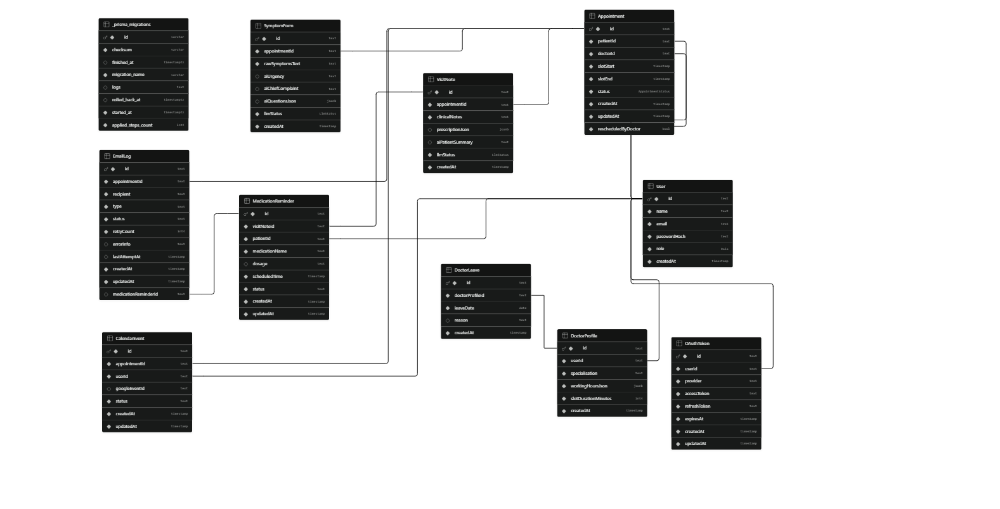

# Technical Architecture
### Healthcare Appointment Manager

## 1. System Overview

The system uses a robust 3-tier web architecture. It relies on a React/Vite frontend, a Node.js/Express backend, and a PostgreSQL database. To ensure the critical paths (like appointment booking) remain lightning fast and highly resilient, all external side-effects (LLM summarization, email notifications, Google Calendar syncing) are processed asynchronously via persistent background workers.

## 2. Frontend Architecture

The frontend is built as a Single Page Application (SPA) using React and Vite. It employs role-based routing (Patient, Doctor, Admin) to ensure secure access to different portals. UI state is managed locally with API calls handled securely by Axios interceptors that attach JWT tokens.

## 3. Backend Architecture

The backend is built with Node.js and Express.js, providing a robust REST API. It strictly separates concerns: thin controllers handle request/response formatting, while dedicated service layers implement core business logic. Prisma ORM is used for all database interactions. The backend process also runs continuous `node-cron` workers to handle asynchronous jobs directly within the server instance.

## 4. Database Architecture

The application uses PostgreSQL through Supabase for persistent data storage. The schema manages users, doctor profiles, appointments, visit notes, symptoms, Google Calendar events, OAuth tokens, doctor leaves, medication reminders, and notification logs.

The following Entity-Relationship diagram shows the major database entities and their relationships:

## 5. Authentication and Authorization

Authentication uses stateless JSON Web Tokens (JWT) signed with a secure server-side secret (`JWT_SECRET`). Passwords are mathematically hashed via bcrypt and never exposed. Authorization is enforced at the route level through middleware that inspects the role encoded in the JWT (PATIENT, DOCTOR, or ADMIN).

## 6. Appointment Booking and Concurrency Protection

Double-booking is prevented entirely at the database layer using PostgreSQL unique constraints and transactions. The `Appointment` table includes a partial unique index on `(doctorId, slotStart)`. When a booking is attempted, the backend wraps the insertion inside a Prisma database transaction. If two concurrent requests attempt to book the same slot, only the first transaction commits, guaranteeing strict atomic consistency without external distributed locks.

## 7. Google Calendar Integration

The system uses standard Google OAuth 2.0 to securely connect users' Google Calendars. It requires the `https://www.googleapis.com/auth/calendar.events` scope. When a patient or doctor connects their calendar, OAuth tokens are encrypted and stored in the backend database. Calendar synchronization uses the `Asia/Kolkata` timezone to ensure accurate local slot times for the user.

## 8. Notification / Email Architecture

The system uses Nodemailer for email delivery. To prevent network timeouts from breaking primary user actions, emails are never sent synchronously. Instead, actions (like booking an appointment) write pending records to an `EmailLog` table. An asynchronous email retry worker running on `node-cron` polls for pending emails and attempts delivery, applying a retry-and-backoff mechanism upon failure.

## 9. Doctor Leave Conflict Cascade

When an administrator marks a doctor on leave for a specific date, the system triggers an atomic conflict cascade. Inside a single strict Prisma transaction, the system records the leave, identifies overlapping scheduled appointments, and marks them as cancelled. Crucially, no external API calls are made during the transaction. Notifications and Calendar deletions are handed off to the async workers after the transaction commits successfully.

## 10. Medication Reminder Architecture

Doctors can issue prescriptions that include frequency and duration instructions. The backend parses this data to generate specific `MedicationReminder` records using `Asia/Kolkata` time boundaries. A dedicated `reminder-scheduler` cron job polls these records every 5 minutes and atomically creates corresponding `EmailLog` entries to dispatch the reminders without duplication.

## 11. AI / Symptom Processing

Patients submit pre-visit symptoms, and doctors submit post-visit clinical notes. The backend integrates with the Google Gemini API to generate structured patient summaries. If the LLM integration times out or fails, the system logs the failure and gracefully degrades (allowing the appointment or note submission to succeed), ensuring third-party API reliability issues never block essential healthcare operations.

## 12. Deployment Architecture

The application is deployed across specialized hosting providers:
- **Frontend**: Vercel hosts the React/Vite SPA.
- **Backend**: Render hosts the Node.js/Express backend as a persistent Web Service. This is required over serverless architectures to keep the `node-cron` background workers running continuously.
- **Database**: Supabase provides the production PostgreSQL database.

## 13. Failure Handling / Reliability

All integrations with external systems (Google Calendar, Nodemailer, Gemini AI) are engineered for isolation. A failure in generating an AI summary, dispatching a calendar invite, or delivering an email will strictly never roll back a successful appointment booking, doctor leave entry, or clinical note submission.
